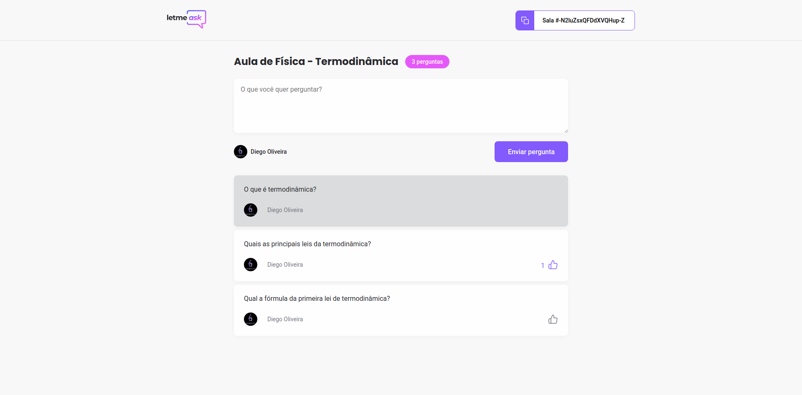
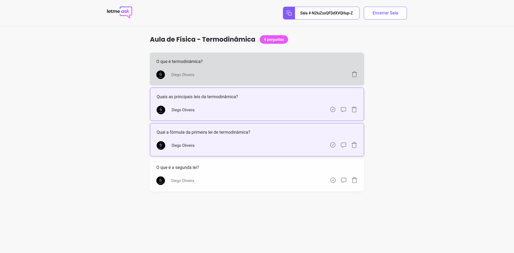

<p align="center">
  
</p>

<h1 align="center">
    
</h1>

<br>

## 💻 Link Preview
https://letmeask-8e8b5.web.app/

## 🧪 Technologies

This project was developed with the following technologies:

- [React](https://reactjs.org)
- [Firebase](https://firebase.google.com/)
- [TypeScript](https://www.typescriptlang.org/)

## 🚀 How to run

1. Clone the repository and access its folder.

```bash
$ git clone https://github.com/diogoditorr/nlw-06-react
$ cd nlw-6-react
```

2. Install dependencies:

```bash
$ yarn
```

3. Create a [Firebase](https://firebase.google.com) project and set up a Realtime Database.

4. Add your Firabase project's configuration to the project by creating a file called `.env` in the root of the project and setting the following environment variables: (There is a `.env.example` as well)

```
REACT_APP_API_KEY=
REACT_APP_AUTH_DOMAIN=
REACT_APP_DATABASE_URL=
REACT_APP_PROJECT_ID=
REACT_APP_STORAGE_BUCKET=
REACT_APP_MESSAGING_SENDER_ID=
REACT_APP_APP_ID=
```

5. Start the project

```bash
$ yarn start
```

The app will be available in the browser at http://localhost:3000.


## 💻 Project

*Letmeask* is a platform that allows content creators to create Q&A rroms with their audience in a organized and democratic way.

This project was developed as part of **[Next Level Week Together](https://nextlevelweek.com/)**, which took place from June 20-27, 2021.

<div align="center">
  
  
</div>

## 🔖 Layout

THe project's layout is available on Figma:

- [Layout Web](https://www.figma.com/community/file/1009824839797878169/Letmeask) 

You will need a [Figma](http://figma.com/) account to view the layout.

## 📝 License

This project is licensed under the MIT License. See the [LICENSE](LICENSE) file for more details.
